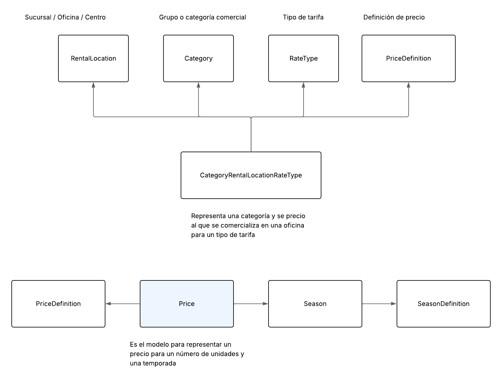

# Tarea

## Objetivo 1

Implementar los servicios para poder mostrar los precios de múltiples productos en una única pantalla.

### Modelo de datos

#### Definición de precios

Este modelo es muy importe ya que permite definir un conjunto de precios que se vincula con una categoría,
una sucursal y un tipo de tarifa. Al definir este modelo de esta forma podemos desacoplamos el precio de la
categoría y permite aprovecharlo en otras partes del sistema como las tarifas de los extras.

Define una serie de propiedades importantes:

### Más detalles

- Puedes partir de la maquetación base que puedes ver en [Ejemplo funcional](../sample_task.html)