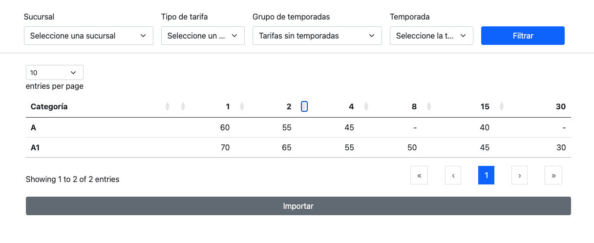

# Tarea

## Objetivo 1

Implementar los servicios para poder mostrar los precios de múltiples productos en una única pantalla.

Puedes partir de la maquetación base que puedes ver en [Ejemplo funcional](../sample_task.html)